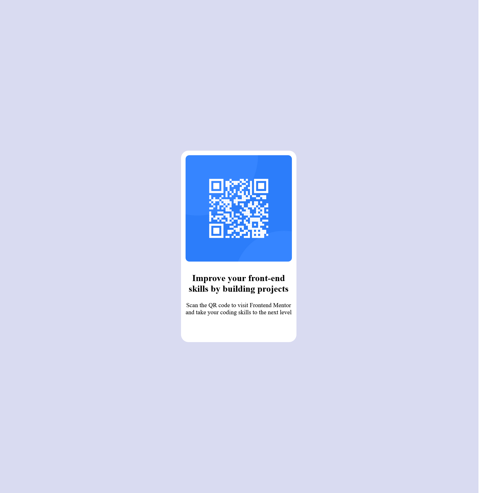

# Frontend Mentor - QR code component solution

This is a solution to the [QR code component challenge on Frontend Mentor](https://www.frontendmentor.io/challenges/qr-code-component-iux_sIO_H). Frontend Mentor challenges help you improve your coding skills by building realistic projects. 

## Table of contents

- [Screenshot](#screenshot)
- [My process](#my-process)
  - [Built with](#built-with)
  - [What I learned](#what-i-learned)
  - [Continued development](#continued-development)
- [Author](#author)


## Screenshot



## My process

### Built with

- Semantic HTML5 markup
- CSS custom properties
- Flexbox

### What I learned

```css
.container {
    height: 100%;
    display: flex;
    align-items: center;
    justify-content: center;
    background-color: #D9DBF1
}
```

I learned about using an container in order to align the items to my liking

### Continued development

In further projects, I will keep working on the flexibility of screen height and width.

## Author

- Website - [Dirk Mosterd](https://www.dirkmosterd.nl)
- Frontend Mentor - [@Dirk-nl](https://www.frontendmentor.io/profile/Dirk-nl)